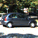
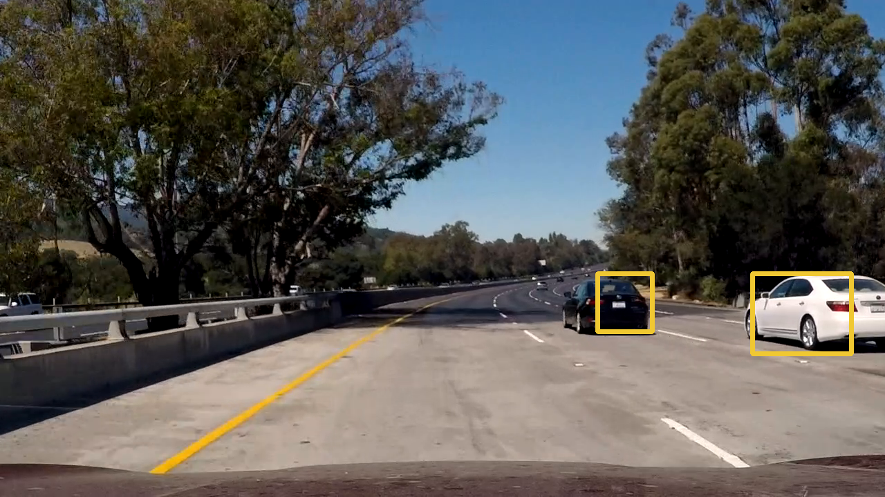

## Writeup _Vehicle Detection Project_

Paweł Kołodziej <p.kolodziej@gmail.com>

## [Rubric](https://review.udacity.com/#!/rubrics/513/view) Points
###Here I will consider the rubric points individually and describe how I addressed each point in my implementation.  

---

###Writeup / README

####1. Provide a Writeup / README that includes all the rubric points and how you addressed each one.  You can submit your writeup as markdown or pdf.  [Here](https://github.com/udacity/CarND-Vehicle-Detection/blob/master/writeup_template.md) is a template writeup for this project you can use as a guide and a starting point.  

You're reading it!

###Histogram of Oriented Gradients (HOG)

####1. Explain how (and identify where in your code) you extracted HOG features from the training images.

_Note: all code is located in directory `pkvd`_

HOG extraction is perofrmed in file 'preproc.py' in class CarFrame. This class extracts HOG from the whole frame and then returns HOG in windows as requested.

Parameters used for HOG:

* orientations: 4
* pixles per cell: 8
* cells in block: 2,2

Before computing HOG image is converted into HLS colorspace. H, L and S
channels are used for HOG. L&S were  useful in lane detection project so the
are good candidate for car detection as well (both cars and lane lines are
solid color).

Sample images from this step far image of car:

input image:

H, L & S channels:

HOG in H, L and S:
.png)
.png)
.png)

And the same for non-car image:

H, L & S channels:

HOG in H, L and S:
.png)
.png)
.png)

####2. Explain how you settled on your final choice of HOG parameters.

My SVM models on HOG tends to overfit very badly (train error less then 0.01%
and test error greater then 2%). One way to combat that was to try make
features vector small. That's why I choose `orientations` equal 4. This way
feature vector is rather small (2592 floats per frame) and I have more samples
(images) then features. (about 17000 original images + 8000 generated from
them). It also has comparable test & training error.

####3. Describe how (and identify where in your code) you trained a classifier using your selected HOG features (and color features if you used them).

I've chosen linear SVM. It's trained in file `train.py`

Function `get_xy` prepares data. I've used data augmentation to combat high
false positive rate of classifier. Each image from 'non-vehicle' class is used
twice. First 'as is' then scaled up & cropped.

Features are computed in class `CarFrame` in file `preproc.py`. Finally I use
only HOG features. I've tried color histogram as well but it resulted in more
false positives.

In final code you can see that I'm using only 5% of data for testing - that's 
because I wanted to use as much data as possible. In the end it's performance on
windows from test video that matters. However during choosing parameters of
model (`C` and `orientations` of HOG) I've used more conservative split 80-20.

###Sliding Window Search

####1. Describe how (and identify where in your code) you implemented a sliding window search.  How did you decide what scales to search and how much to overlap windows?

I use 3 sizes of windows: 64 (by 64), 64/0.75 = 85, and 64/0.5=128. They are
defined in function `find_car()` in `detect.py` (list `cfg`). Each windows is
used to scan only interesting area of image:

* windows 64x64: scan Y in range 0.55 of image height to 0.65
* windows 85x85: scan Y: 0.55 to 0.8
* windows 128x128: scan Y: 0.55 to 0.85

I've tried various sizes of windows and looked which size is detected as car moves
from bottom to top of image. Unfortunately car which is on the right side is
visible quite high in the image despite being near camera. It's why relatively
large window must be used on almost whole height of road.

Window is moved by 24/64 (which is 3/8) of it width & height. Moving window by smaller step means
doing more classifications and more chance for false positive. Increasing step
also increases probability of not finding car. Step of 3/8 worked best for me.

Results of using sliding window is shown on image bellow. Solid blue lines on the left indicates Y zone in which various windows are used.

As you can see both cars triggers a lot of "hits". There are also 3 false positives.

####2. Show some examples of test images to demonstrate how your pipeline is working.  What did you do to optimize the performance of your classifier?

Images from the pipeline has been shown in previous sections. 

Some performance optimization are:

* use multithreading (via module `joblib`) to compute features from training images
* compute HOG for whole image and then subsample it
* use ROI (it also combats false positives, before implementing ROI I often
    had lot of detected cars high in the sky).

In the end my implementation achieves about 2fps on my laptop.

### Video Implementation

####1. Provide a link to your final video output.  Your pipeline should perform reasonably well on the entire project video (somewhat wobbly or unstable bounding boxes are ok as long as you are identifying the vehicles most of the
time with minimal false positives.) 

Here's a [link to my video result](./res.mp4)

####2. Describe how (and identify where in your code) you implemented some kind of filter for false positives and some method for combining overlapping bounding boxes.

After sliding windows are applied to video frame (in each size of them) in
`find_car()` (file `detect.py`) heat map is constructed.  Then when video is
processed object of class `CarFinder` (`detect.py`) holds
heat maps from last 30 frames. It sum them up and thresholds at level 60. 

This 30 frames represents quite long time. When car has grater speed then the one with
camera then it tends to have "tail" in detection - area in which it used to be is
still hot enough in last 30 frames. On the other hand this provides quite good
protection from false positives which are transient.

After threshold  heat map is segmented using `scipy.ndimage.measurements.label()`.
It happens in function `hmap2bbox()` in `detection.py`.  After segmenting and
determining bounding boxes very small detections are rejected (area smaller then
40x40).

### Here are six frames, their corresponding heatmaps and accumulated heatmaps:

### Here is the output of `scipy.ndimage.measurements.label()` on the integrated heatmap from all six frames:

### Here the resulting bounding boxes are drawn onto the last frame in the series:

---

###Discussion

####1. Briefly discuss any problems / issues you faced in your implementation of this project.  Where will your pipeline likely fail?  What could you do to make it more robust?

Major problem was overfiting of classifier and then high false positive ratio. I
tries to combat it using short feature vector and long integration window for
heat maps. 
